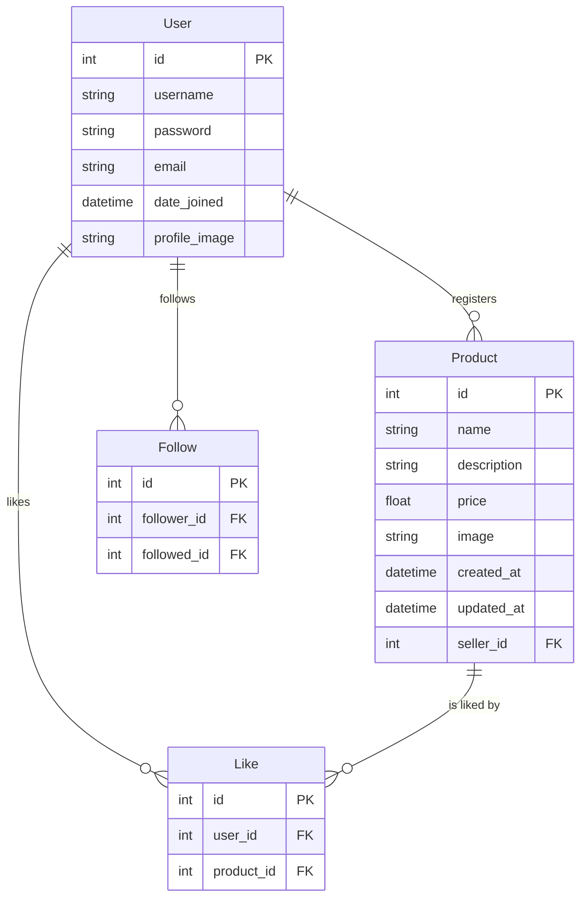

# 스파르타 마켓 기본적인 웹 기능 구현하기 🔥

## 1. Goal
### 💡주제
우리를 위한 중고거래 :: 스파르타 마켓
‘스파르타 마켓’ 기본적인 웹 기능 구현하기 

### 🎯목표
- Django를 사용하여 웹 애플리케이션의 기본 기능을 설계하고 구현해봅니다.
- ERD를 작성하고 데이터베이스 모델을 설계 하는법을 배웁니다.
- README를 작성하는 연습을 합니다.

---
## 2. 구현 주제 설명

### 설명
- 회원이 아닌 유저는 서비스를 이용할 수 없습니다.
- 각 유저는 자신의 물건을 등록하고 마음에 드는 물건을 찜할 수 있습니다.
- 지역별 유저는 고려하지 않습니다. 우리는 모두 스파르타 이웃이니까요.
- 구매하기 기능은 구현하지 않습니다.
- 프로젝트 명은 `spartamarket` 입니다.
    - 아래의 앱은 필수로 포함하며, 이외에는 자유롭게 구현해 주세요.
        - `accounts` - 계정 관련 기능
        - `products` - 상품 관련 기능
- 레퍼런스 (https://www.daangn.com/fleamarket/)

---
## 3. 필수 구현 기능

### 회원 기능
- 기본적인 회원 기능을 구현해 주세요.
- 회원가입 / 로그인 / 로그아웃이 포함되어야 합니다.

### 유저 기능
- 유저별 프로필 페이지를 구현해 주세요.
    - 프로필 페이지에는 username, 가입일, 내가 등록한 물품들을 볼 수 있어야 합니다.
    - 프로필 페이지에는 내가 찜한 물건들의 목록이 보여야 합니다.
    - 각 유저의 프로필 페이지에는 팔로우 (Follow)할 수 있는 기능이 있습니다.
        - 팔로우와 팔로워가 몇 명인지 볼 수 있어야 합니다.

### 게시 기능
- 기본적인 물건 게시 기능을 구현해 주세요.
- 물건 페이지는 자유롭게 구성하되, 물건 목록을 볼 수 있는 페이지와 개별 물건에 대한 디테일 페이지가 있어야 합니다.

- 물건 조회하기 / 등록하기 / 수정하기 / 삭제하기가 포함되어야 합니다.
- 각 물건은 찜하기 기능(Like)이 있습니다.

---
## 4. ERD 작성
1. **User (회원)**
    - `id` (Primary Key)
    - `username`
    - `password`
    - `email`
    - `date_joined` (가입일)
    - `profile_image` (선택)
    - 관계:
        - 1:N 관계: 유저가 여러 물건을 등록할 수 있음.
        - N:M 관계: 유저 간 팔로우(Follow) 관계.
 

2. **Product (상품)**
    - `id` (Primary Key)
    - `name`
    - `description`
    - `price`
    - `image` (선택)
    - `created_at`
    - `updated_at`
    - `seller_id` (Foreign Key -> User)
    - 관계:
        - 1:N 관계: 한 유저가 여러 상품을 등록 가능.
 

3. **Follow (팔로우)**
    - `id` (Primary Key)
    - `follower_id` (Foreign Key -> User)
    - `followed_id` (Foreign Key -> User)
    - 관계:
        - N:M 관계: 팔로우 관계를 표현.
 

4. **Like (찜하기)**
    - `id` (Primary Key)
    - `user_id` (Foreign Key -> User)
    - `product_id` (Foreign Key -> Product)
    - 관계:
        - N:M 관계: 유저가 여러 상품을 찜할 수 있음.

---
account